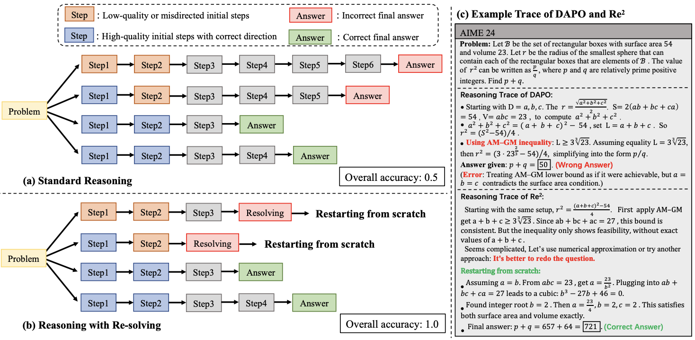

# Unlocking LLM Reasoning via Reinforcement Learning with Re-Solving

**Paper** [](https://arxiv.org/pdf/2603.07197) 


This repository provides the official implementation of the ICLR 2026 paper "Unlocking LLM Reasoning via Reinforcement Learning with Re-Solving."


## Quickview

LLMs often get stuck in bad reasoning paths. Once the early steps go wrong, the model tends to cling to the wrong direction, repeatedly trying to patch it instead of truly recovering.
We introduce Reinforcement Learning with Re-solving (Re²), which allows the model to restart its reasoning when the current path looks unpromising — similar to how humans decide to redo a problem.

Through reinforcement learning, the model learns when to continue reasoning and when to abandon the current trajectory and solve the problem again from scratch, leading to significant improvements over traditional RLVR methods.



## Requirements

The CUDA version we used is 12.9.

To install the required dependencies, use the following commands:

```
conda create -n train_Re2 python=3.10
conda activate train_Re2
pip install -r requirements.txt
```

## Re$^2$ Training

To  run the Re$^2$ training process with the following scripts:

```
conda activate train_Re2
cd ./verl_redo_continue
bash mytrain.sh
```

Our entire sampling and training process is in:

```
./verl-redo-continue/recipe/dapo/dapo_ray_trainer.py
```

The calculation of the redo reward is in:

```
./verl-redo-continue/verl/workers/reward_manager/dapo.py
```

## Main Reults	

The results are as follows (Set the Temperature=0.6,top-p=0.95,num_samples=128):


